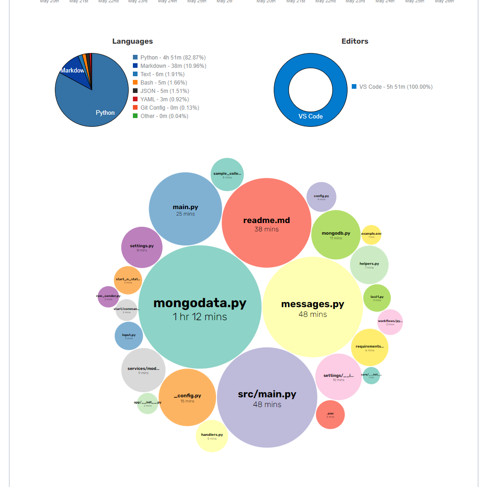

# TestRLT


## Dependencies

Для запуска по данной инструкции потребуется Docker, python3.10+, python-venv, Debian - подобная система


## Setup

1. Запустим и скопируем базу MongoDB

```shell
docker run --name mongo -d -e MONGO_INITDB_ROOT_USERNAME=mongo -e MONGO_INITDB_ROOT_PASSWORD=mongo -p 27017:27017 mongo:latest
docker cp ./dump mongo:/data/dump
docker exec -it mongo mongorestore -u mongo -p mongo --authenticationDatabase admin -d sample /data/dump
```

2. Настроим окружение и установим зависимости

```shell
python3 -m venv venv
source venv/bin/activate
pip install -r requirements.txt
```

3. Заполним файл .env

```shell
cp example.env .env
nano .env
```

Внутри .env файла будут данные поля:

* `DEBUG` - Запуск в дебаг режиме или обычном, влияет на отправку логов в телеграмм, при False логи остаются только в консоли
* `BETTER_FORMAT` - Запуск в режиме с удобным для чтения человеком отображение json
* `RELOAD` - Запуск в режиме с перезапуском при изменении файлов .py .env, функционал похож на --reload в uvicorn
* `TG_TOKEN` - Токен основного бота для работы с людьми
* `TG_LOG_TOKEN` - Токен бота для логов, может быть как отдельным так и тем же, что используется для работы с людьми
* `TG_LOG_CHANNEL` - Id телеграмм канала для логов
* `MONGO_URL` - Url для подключения к базе данных MongoDB 
* `MONGODB_DATABASE` - Имя базы данных
* `MONGODB_COLLECTION` - Имя коллекции с данными

По желанию можете запустить админ панель для базы

```shell
docker run -d --name mongo-express -e ME_CONFIG_MONGODB_ADMINUSERNAME=mongo -e ME_CONFIG_MONGODB_ADMINPASSWORD=mongo -e ME_CONFIG_MONGODB_SERVER=mongo --link mongo:mongo -p 8081:8081 mongo-express:latest
```

## Start

Для запуска введите из корня проекта команду 

```shell
python src/main.py
```

## Other

Затраченное на проект время:




